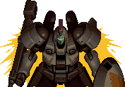

# river-raid-game

### Clássico jogo River Raid feito em HTML, CSS e JAVASCRIPT

## Controles no TECLADO (Somente para pc)

- | <- | para andar para a esquerda
- | -> | para andar para a direita

## Features

- Sitema de pontuação

- Sistema de colição

- Caminhos postos de maneira alatória

- Controles para o personagem

| Nome           | Descrição                                                             |
| -------------- | --------------------------------------------------------------------- |
| **EXPLICAÇÃO** | [YOUTUBE](https://youtu.be/ecVPGMlsfP4)                               |
| **PERSONAGEM** | </img>          |
| **MOEDA**      | </img>    |
| **BATERIA**    | </img>   |
| **CENÁRIO**    | </img> |
| **PAREDES**    | </img>      |
